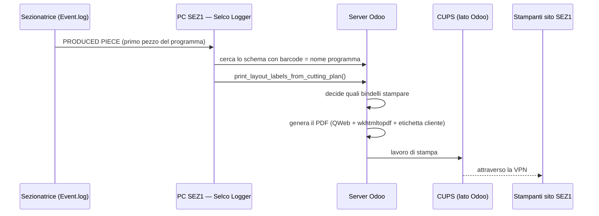
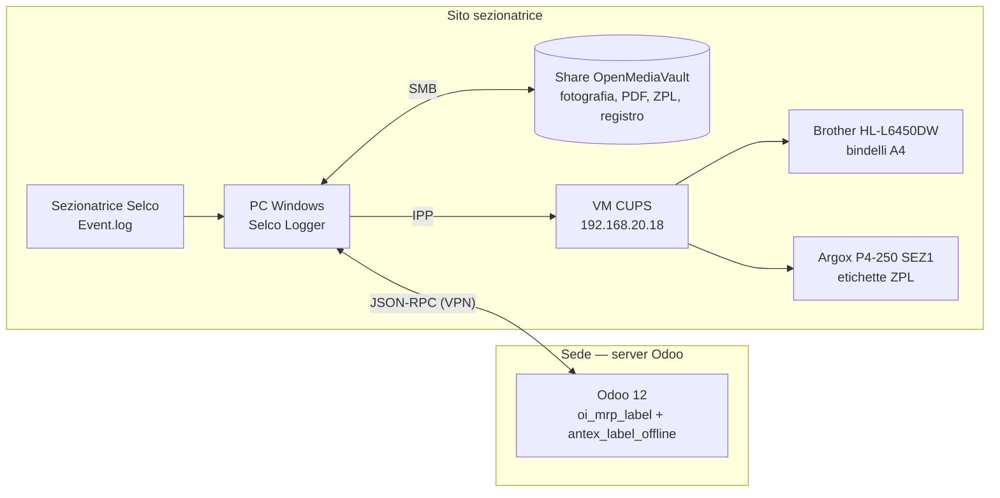
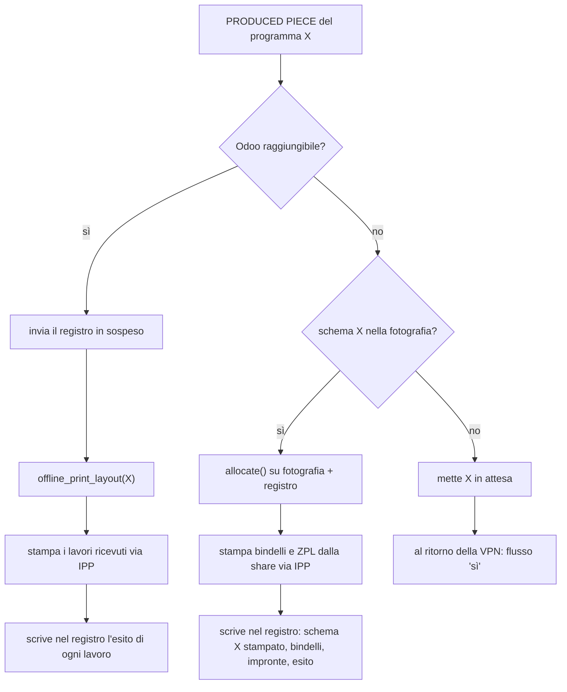
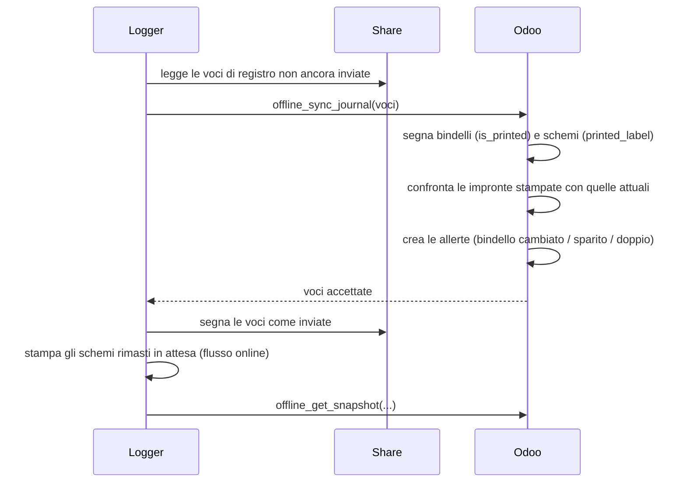

# Stampa bindelli SEZ1 con VPN non disponibile — documento di progetto

Stato: **bozza per revisione** · Ultimo aggiornamento: 30/09/2026 (rev. 2: lettura del log e registrazioni di produttività)

## 1. Contesto e problema

Il PC della sezionatrice Selco (SEZ1) e le sue stampanti si trovano in un sito diverso da quello del server
Odoo e comunicano con Odoo attraverso una VPN. Il programma *Selco Logger*
([antexsrl/loggerselco](https://github.com/antexsrl/loggerselco)) legge il log della sezionatrice e,
al primo pezzo finito di ogni programma di taglio, chiede a Odoo di stampare i bindelli di produzione.

Quando la VPN cade il PC non vede Odoo, quindi **i bindelli non escono**. Al ritorno della VPN il logger
ripete le chiamate e i bindelli arretrati escono tutti insieme, quando i pezzi sono già stati tagliati e
spostati.

**Obiettivo:** i bindelli (e le etichette ID in ZPL) devono uscire al momento del taglio anche quando
Odoo non è raggiungibile. Al ritorno della VPN Odoo deve risultare allineato, come se la stampa fosse
avvenuta normalmente.

## 2. Come funziona oggi



### 2.1 Chi decide cosa stampare

`mrp.sale.plan.layout.print_layout_labels_from_cutting_plan()` (modulo `oi_mrp_label`). Per ogni riga
dello schema:

- il tipo di bindello è `frame` (cartella) se il materiale è della categoria cartella
  (`antex_product.product_car_category`), altrimenti `support`;
- **pezzi da coprire** = pezzi degli schemi già stampati + pezzi di questo schema − pezzi dei bindelli già
  stampati;
- stampa i bindelli non ancora stampati, in ordine di numero (`label_sub`), finché la quantità non è
  coperta;
- segna i bindelli come stampati (`is_printed`) e lo schema come stampato (`printed_label`).

La "produzione fatta finora" non viene dai contatori della macchina: sono solo questi due indicatori.

Esempio, riga da 60 pezzi con 3 bindelli da 20:

| Taglio | Pezzi dello schema | Tagliati finora | Già coperti | Da coprire | Stampa |
|---|---|---|---|---|---|
| Schema A | 15 | 15 | 0 | 15 | bindello 1 |
| Schema B | 15 | 30 | 20 | 10 | bindello 2 |
| Schema C | 30 | 60 | 40 | 20 | bindello 3 |

L'ordine di taglio non cambia il totale: tagliando C prima di B escono comunque i tre bindelli, cambia solo
quale schema fa uscire quale bindello.

> **Correzione già fatta (oi_mrp_label 12.0.32.0.0, 28/09/2026).** Il conteggio dei pezzi tagliati era
> limitato al piano di taglio in corso, mentre i bindelli stampati erano contati su tutti i piani. Una
> riga divisa su due piani dello stesso tipo non stampava i bindelli del secondo piano. Lo stesso
> succedeva con una riga presente due volte nello stesso schema. La logica descritta qui è quella corretta.

### 2.2 Come si stampa

`mrp.production.label.print_label()`:

| Caso | Comportamento |
|---|---|
| Bindello cartella (`frame`) | una stampa |
| Bindello supporto con `highlighted_label` | prima pagina (o le prime 2 se fronte/retro) dal cassetto `TRAY2` (carta colorata), il resto da `TRAY1`, poi le copie restanti |
| Bindello supporto normale | `copies` = `product_mod_id.label_copies`; 2 copie fisse per i clienti `025` e `001` |
| Ordine con etichetta cliente (`label_pdf`) | fronte/retro (`Duplex=DuplexNoTumble`); il PDF contiene bindello + etichetta cliente sul retro (casi speciali per i clienti `025`, `001`, `032` in `ir_actions_report._run_wkhtmltopdf`) |
| Etichetta aggiuntiva (`additional_label`) | report `report_label_attachment`, `additional_label_copies` copie |
| ID PDT | `pcs_id` della riga dello schema, stampato sulla prima fase di sezionatura |

Le etichette ID in ZPL (`antex_jit_label`) vengono stampate subito dopo, per i modelli con
`zpl_print_label`. Sono tante copie quanti i pezzi della riga nello schema (`qt_on_layout`), con un testo
ZPL per ordine di produzione. Non dipendono dal calcolo dei bindelli.

Stampanti usate (utente Odoo `sezselco`): `Brother_HL-L6450DW_series` per i bindelli,
`ARGOX-P4-250-PPLA-SEZ1` per le ZPL.

## 3. Decisioni prese

| # | Decisione |
|---|---|
| D1 | La stampa parte **sempre dal sito della sezionatrice**, con o senza VPN. Odoo non manda più lavori di stampa oltre la VPN per SEZ1. |
| D2 | Stampa tramite il **CUPS sulla VM 192.168.20.18**, sul sito della sezionatrice (raggiungibile a VPN giù). Ha già le code `Brother_HL-L6450DW_series` e `ARGOX-P4-250-PPLA-SEZ1`, con gli stessi nomi usati da Odoo. |
| D3 | **VPN attiva:** decide Odoo, come oggi, ma restituisce al logger i PDF e le istruzioni di stampa invece di stampare. |
| D4 | **VPN giù:** il logger rifà lo stesso calcolo di Odoo su una **fotografia** scaricata in precedenza e stampa i PDF già pronti. |
| D5 | Fotografia e PDF stanno sulla **share OpenMediaVault** del sito, **mai sul disco del PC**. Si conserva un giorno. |
| D6 | Il bindello può cambiare fino all'ultimo: la fotografia viene **aggiornata di continuo** mentre la VPN funziona. A VPN giù si stampa l'ultima versione scaricata. |
| D7 | Al ritorno della VPN il logger invia il **registro delle stampe prima di qualsiasi nuova stampa**. Odoo segna bindelli e schemi come stampati e segnala i bindelli cambiati nel frattempo. |
| D8 | **Anche le etichette ZPL** escono a VPN giù. |
| D9 | **La stampa manuale è bloccata** (procedura guidata, solo anteprima) per i bindelli presenti nella fotografia attiva del logger. Il gruppo *Superuser labels* può forzarla e la forzatura resta registrata. |
| D10 | Il calcolo dei bindelli è scritto **una sola volta**, come funzione Python senza database, usata sia da Odoo sia dal logger. |
| D11 | La lettura di `Event.log` usa il motore incrementale di `event_new_copy_v2.py` (§9): legge solo i byte nuovi, non tiene il file aperto, reagisce in circa 2 secondi. |
| D12 | Le registrazioni di produttività e fermo inviate a Odoo vengono ricalcolate con un nuovo algoritmo (§10), che assegna il tempo al programma che produce pannelli ed elimina i record a tempo zero. |

## 4. Architettura



Solo la freccia PC ↔ Odoo passa dalla VPN. Tutto quello che serve per stampare (fotografia, PDF, CUPS,
stampanti) è sul sito.

### 4.1 Componenti e repository

```
selco_offline/
├── docs/                       questo documento
├── odoo/antex_label_offline/   modulo Odoo (copia; i test girano da addons_antex_skilled)
├── logger/                     evoluzione di loggerselco
├── shared/label_allocation.py  calcolo dei bindelli, senza database
└── tools/replay/               banco di prova: rigioca un Event.log reale con un Odoo finto
```

`shared/label_allocation.py` è l'unica copia del calcolo. Il modulo Odoo e il logger ne includono una
copia identica. Un test in ciascuno dei due confronta la propria copia con quella di `shared/` e fallisce
se sono diverse.

## 5. Modulo Odoo `antex_label_offline`

Dipende da `oi_mrp_label`, `antex_jit_label`, `mrp_sale_plan`, `base_report_to_printer`.

### 5.1 Istruzioni di stampa separate dalla stampa (in `oi_mrp_label`)

`print_label()` oggi decide copie, cassetti e pagine **e** manda il lavoro a CUPS. Lo dividiamo in due:

- `_prepare_print_jobs()` restituisce l'elenco dei lavori: coda, PDF, opzioni (`copies`, `InputSlot`,
  `page-ranges`, `Duplex`);
- `print_label()` prepara i lavori e li manda a CUPS: **stesso comportamento di oggi** per chi stampa da
  Odoo (altri reparti, procedura guidata).

La modifica va in `oi_mrp_label`, perché copre tutti i casi della tabella 2.2 e non deve esistere in due
copie. Lo stesso per le ZPL in `antex_jit_label` (`_prepare_id_label_zpl()` restituisce il testo,
`print_ID_label()` lo stampa).

Ogni lavoro ha questa forma:

```json
{
  "queue": "Brother_HL-L6450DW_series",
  "document": "label:1234:ab12cd…",
  "format": "application/pdf",
  "options": {"copies": 1, "InputSlot": "TRAY2", "page-ranges": "1-2", "Duplex": "DuplexNoTumble"}
}
```

`document` punta a un file della fotografia (§6), così lo stesso PDF non viaggia due volte.

### 5.2 Calcolo dei bindelli

`print_layout_labels_from_cutting_plan()` usa `label_allocation.allocate()` (§7) invece del ciclo
attuale: stesso risultato, ma lo stesso codice gira anche nel logger.

### 5.3 Metodi chiamati dal logger (JSON-RPC, utente `sezselco`)

| Metodo | Uso |
|---|---|
| `offline_get_snapshot(workcenter_code, known_documents)` | Restituisce la fotografia (§6). `known_documents` sono le impronte già presenti sulla share: Odoo rimanda solo i PDF/ZPL nuovi o cambiati. |
| `offline_confirm_snapshot(snapshot_id)` | Il logger conferma di aver scritto la fotografia sulla share. Da qui in poi è la fotografia **attiva** (serve al blocco D9). |
| `offline_sync_journal(entries)` | Riceve il registro delle stampe fatte dal logger (§8). Idempotente: ogni voce ha un identificativo univoco. |
| `offline_print_layout(barcode)` | Stampa a VPN attiva: decide come oggi, segna stampato e restituisce i lavori (§5.1) invece di stampare. |

### 5.4 Nuovi modelli

- `label.offline.snapshot`: fotografie consegnate al logger (centro di lavoro, data, bindelli inclusi,
  stato *consegnata / attiva / sostituita*).
- `label.offline.journal`: voci di registro ricevute (identificativo, data di stampa sul sito, bindello o
  ZPL, schema, impronta stampata, esito).
- `label.offline.alert`: bindelli da verificare. Un'allerta nasce quando il bindello stampato a VPN giù è
  diverso dalla versione attuale, quando il registro cita un bindello che non esiste più (bindelli
  rigenerati durante il guasto), oppure quando un bindello è stato stampato due volte. Menu
  *Produzione › Bindelli offline*.

### 5.5 Blocco della stampa manuale (D9)

Nella procedura guidata `mrp.production.label.report.confirmation`, la stampa senza anteprima rifiuta i
bindelli presenti nella fotografia attiva del logger. Il messaggio indica che il bindello verrà stampato
dalla sezionatrice. Gli utenti del gruppo `oi_mrp_label.group_superuser_labels` possono forzarla: la
forzatura viene registrata sul bindello (utente e data).

Il blocco vale solo per i bindelli **non ancora stampati**, perché la ristampa di un bindello già stampato
è già limitata all'anteprima oggi.

## 6. Fotografia sulla share

### 6.1 Cosa contiene

Schemi inclusi: schemi SEZ1 (barcode `PE…`), il cui piano di taglio è stato stampato
(`mrp.sale.plan.material.is_printed`), non ancora stampati (`printed_label = False`), creati negli ultimi
**N giorni** (proposta: 7). Per ciascuno:

- barcode, materiale, tipo (supporto/cartella) e righe (riga d'ordine, pezzi, ID PDT);
- per ogni riga d'ordine coinvolta: bindelli del tipo giusto (id, numero, quantità, già stampato) e pezzi
  già tagliati (schemi stampati dello stesso tipo);
- lavori di stampa di ogni bindello non ancora stampato (§5.1);
- per le righe con `zpl_print_label`: testo ZPL dell'ordine di produzione;
- code di stampa da usare, lette dall'utente `sezselco` (`printing_printer_id`,
  `zpl_printing_printer_id`).

L'ID PDT (`pcs_id`) viene dall'ottimizzatore ed è lo stesso per una riga d'ordine in tutti gli schemi della
stessa ottimizzazione. Il PDF di un bindello quindi non dipende da quale schema lo farà uscire: basta un PDF
per bindello.

### 6.2 Aggiornamento senza sovraccaricare il server

Volumi SEZ1 (giugno–agosto 2026, database di test): in media **41 schemi e 85 righe d'ordine al giorno**
(massimo 80 e 167), **2,5 bindelli per riga**, cioè circa 200 PDF al giorno, fino a circa 400.
Rigenerarli tutti ogni 15 minuti con wkhtmltopdf sarebbe troppo pesante.

Per ogni bindello Odoo calcola quindi un'**impronta** dell'HTML QWeb, escludendo la riga di piè di pagina
con operatore e data/ora. Generare l'HTML è molto più veloce del PDF. Il PDF viene rigenerato solo se
l'impronta cambia, e il logger scarica solo i documenti con impronta nuova. Lo stesso vale per le ZPL.

Il piè di pagina del PDF preparato in anticipo riporta la data di generazione, non quella di stampa.

### 6.3 Struttura

```
\\<omv>\<share>\SEZ1\
├── snapshot.json                 fotografia attiva (scrittura su file temporaneo + rinomina)
├── documents\
│   ├── label_1234_ab12cd.pdf     un file per bindello e impronta
│   └── zpl_5678_ef34ab.zpl       un file per ordine di produzione e impronta
└── journal\
    └── 2026-09-30.jsonl          registro delle stampe (una riga JSON per voce)
```

I documenti non più citati dalla fotografia attiva e più vecchi di un giorno vengono cancellati dal logger.

## 7. Il calcolo dei bindelli (`shared/label_allocation.py`)

Funzione pura, senza database:

```python
def allocate(layout, sale_lines):
    """Bindelli da stampare per uno schema.

    layout: {"kind": "support"|"frame", "lines": [{"sale_line": id, "qty": n}, ...]}
    sale_lines: {id: {"cut_before": n,                # pezzi degli schemi già stampati, stesso tipo
                      "labels": [{"id", "sub", "qty", "printed"}, ...]}}
    ritorna: [label_id, ...] nell'ordine di stampa
    """
```

La logica è quella della §2.1 (corretta): per ogni riga, i pezzi tagliati prima (compresi quelli delle righe
precedenti dello stesso schema) più quelli della riga, meno i pezzi dei bindelli già stampati. Si prendono i
bindelli non stampati in ordine di `sub`.

- **Odoo** la chiama con i dati letti dal database.
- **Il logger** la chiama con i dati della fotografia, a cui applica le voci del proprio registro successive
  alla fotografia: bindelli stampati e pezzi degli schemi stampati a VPN giù. La fotografia non viene mai
  modificata: lo stato si ricava sempre da fotografia + registro, e sopravvive al riavvio del PC.

## 8. Il logger

### 8.1 Modifiche

| Modulo | Compito |
|---|---|
| `snapshot.py` | a VPN attiva, ogni *N* minuti (proposta: 15): invia il registro, scarica la fotografia, scrive i documenti nuovi sulla share, conferma la fotografia, pulisce i vecchi documenti |
| `label_allocation.py` | copia di `shared/label_allocation.py` |
| `printing.py` | client IPP verso `http://192.168.20.18:631/printers/<coda>`: invia il documento letto dalla share (in memoria, senza file temporanei) con le opzioni del lavoro |
| `journal.py` | registro sulla share, invio a Odoo, stato locale = fotografia + registro |
| `selco.py` | alla riga `PRODUCED PIECE`, il vecchio `print_layout_labels_from_cutting_plan()` viene sostituito dal flusso della §8.2 |
| `eventlog.py` | lettura incrementale di `Event.log` (§9), al posto di `prepare_eventfile()` / `process_eventfile()` |
| `productivity.py` | nuovo algoritmo delle registrazioni di produttività e fermo (§10), al posto di `close_programs()` e dei rami relativi di `process_buffer()` |

Le opzioni dei lavori sono le stesse che `lp -o` passerebbe a CUPS (`InputSlot`, `page-ranges`, `Duplex`,
`copies`). Il client IPP va verificato con una stampa di prova da cassetto `TRAY2` prima di tutto il resto.

### 8.2 Flusso al primo pezzo finito



Uno schema non presente nella fotografia (piano creato a VPN già giù) si comporta come oggi: esce al
ritorno della VPN.

### 8.3 Ritorno della VPN



Se una stampa via IPP fallisce, la voce di registro riporta l'errore e il bindello non viene considerato
stampato, né dal logger né da Odoo. Resta disponibile per lo schema successivo, come oggi.

## 9. Lettura di `Event.log`

### 9.1 Oggi

Ogni 60 secondi `prepare_eventfile()` copia per intero `EvtBack.log` e `Event.log` in `event_tmp.log` sul
disco del PC. `process_eventfile()` rilegge poi il file dal fondo fino all'ultima riga già elaborata.
`EvtBack.log` copre circa tre settimane (8–28/05/2026: 101.868 righe, 6,7 MB), quindi a ogni ciclo si
copiano quasi 10 MB per trovare poche righe nuove. Il file viene aperto mentre il software OSI lo scrive:
il log errori riporta frequenti `Permission denied` su `Event.log`.

### 9.2 Motore incrementale (da `event_new_copy_v2.py`)

Dallo script `event_new_copy_v2.py` (metodo `tail_windows_copy_method`) prendiamo:

- **nessun file tenuto aperto:** ogni 0,5 s si guarda solo la dimensione del file (`os.path.getsize`);
- **solo i byte nuovi:** se il file è cresciuto (al massimo ogni 2 s), lo si apre per il tempo di una
  `seek` + `read` dalla posizione precedente;
- **righe incomplete:** l'ultima riga senza a capo resta in un buffer e si completa alla lettura successiva;
- **file troncato o ricreato:** se la dimensione cala, si riparte da capo;
- il parser `format_event()`, che trasforma le righe in eventi (`start_program`, `produced_piece`,
  `boards_done`).

Il risultato: `PRODUCED PIECE` viene visto in circa 2 secondi invece che fino a 60, quindi i bindelli escono
prima, e per ogni lettura si leggono pochi byte invece di 10 MB.

### 9.3 Cosa cambia rispetto allo script

| Nello script | Nel logger |
|---|---|
| All'avvio salta il contenuto esistente (`tail -f`): gli eventi scritti mentre il logger era spento vanno persi | posizione (byte) e ultima riga elaborata salvate nello stato; al riavvio si riprende da lì |
| Rotazione riconosciuta solo se il file si accorcia | alla rotazione si leggono prima le righe mancanti in coda a `EvtBack.log` (cercando l'ultima riga elaborata), poi `Event.log` dall'inizio; per riconoscere la rotazione si controlla anche la prima riga del file, non solo la dimensione |
| Byte nuovi scritti in un file temporaneo e riletti | decodifica direttamente in memoria (UTF-8: il log contiene `più`), nessun file sul disco |
| Eventi pubblicati su MQTT (192.168.111.9) | eventi passati al logger; la pubblicazione MQTT resta possibile in un secondo momento, con lo stesso formato |
| `format_event()` scarta `Message`, `Session`, `State`, stop | servono al logger (allarmi, fermi, sessioni): il parser viene esteso a questi tipi |

## 10. Registrazioni di produttività e fermo

### 10.1 Il problema: registrazioni a tempo zero

Il logger crea in Odoo le registrazioni di produttività (`mrp.workcenter.productivity`), di lavoro o di
fermo. Capita che arrivino registrazioni con durata zero, soprattutto dopo stop ed emergenze.

Per misurarlo abbiamo fatto girare `selco.py` così com'è sui log reali della macchina, con un Odoo finto
che registra le chiamate (strumento in `tools/replay/`):

| Log | Periodo | Registrazioni | A tempo zero | di cui con pannelli |
|---|---|---|---|---|
| `EventOsi.log` | 28/10–03/11/2025 | 400 | 24 | 12 |
| `EvtBack.log` | 08/05–28/05/2026 | 1.174 | 42 | 13 |
| `Event.log` | 28/05–08/06/2026 | 475 | 18 | 6 |

Tutte le registrazioni a tempo zero sono di lavoro, e 82 su 84 vengono aperte e chiuse dalla stessa riga
del log. I motivi sono due, più un terzo difetto emerso dall'analisi.

**1. Chiusura a cascata dei programmi in coda.** La Selco scrive `Start program` quando carica un
programma nella distinta, anche mentre sta ancora tagliando il precedente. Il logger quindi ha di solito più
programmi aperti. Su `Stop worklist`, `Emergency`, `End Session`, o quando arrivano pannelli di un programma
successivo, `close_programs()` li chiude tutti. Per ciascuno dopo il primo apre una registrazione e la
chiude nello stesso secondo.

Esempio (29/05/2026, emergenza alle 06:26:04):

| Registrazione | Programma | Inizio | Fine | Pannelli |
|---|---|---|---|---|
| 321 | PE2600996_2_31.010 | 06:24:03 | 06:26:04 | 0 |
| 325 | PE2600996_2_31.011 | 06:26:04 | 06:26:04 | 0 ← in coda, mai tagliato in quell'intervallo |
| 326 | fermo | 06:26:04 | 06:39:44 | – |

**2. Programma interrotto che resta "aperto".** Allo stop, `keep_open=True` conserva i programmi. Alla
ripartenza il tempo va al primo della lista, anche se l'operatore ha cambiato programma. Esempio del
29/05/2026:

| Ora | Log | Cosa registra il logger |
|---|---|---|
| 07:37:07 | `Start program` PE2601001_2_0.001 | lavoro su PE2601001 |
| 07:37:32 | `Stop worklist` | fermo |
| 07:38:03 | `Start program` PE2600995_4_01.001 + `Start worklist` | lavoro su **PE2601001** (il programma interrotto) |
| 07:50:37 | `Boards done` 5 di PE2600995_4_01.001 (completo) | chiude PE2601001 (12 min 34 s, 0 pannelli); apre e chiude PE2600995 **a tempo zero con 5 pannelli** |

Il tempo di lavoro del programma vero finisce su un programma che non ha prodotto nulla.

**3. Fermi persi.** Se uno `Stop worklist` arriva subito dopo la fine di un programma, la lista dei
programmi aperti è vuota e il fermo non viene aperto. Il 04/06/2026 lo stop delle 14:19:38 è durato fino
alle 15:58:00, ma non compare in nessuna registrazione.

Gli allarmi OSI monitorati (`MSG_TO_MONITOR`) sono un tema separato. Il controllo sulla durata minima
(`max_time`) è commentato, quindi ogni allarme crea uno stato macchina: nei tre log, 2.936 stati su 5.295
(55%) durano meno della soglia prevista. Solo il 2% dura un secondo o meno.

### 10.2 Nuovo algoritmo: il tempo va a chi produce

Il segnale affidabile di quale programma la macchina sta lavorando è `Boards done`, non `Start program`.

| # | Regola |
|---|---|
| R1 | Una registrazione di lavoro si apre al **primo `Boards done`** di un programma e parte dal momento in cui è finito il lavoro precedente (fine del programma precedente o ripartenza dopo un fermo). I programmi caricati in distinta che non producono nulla non generano registrazioni. |
| R2 | **Passaggio di consegne:** se arrivano pannelli del programma B mentre è aperto A, A si chiude all'ora del suo **ultimo pannello** e B parte da lì. |
| R3 | Quando `done` raggiunge `to do`, la registrazione si chiude su quel pannello. |
| R4 | `Stop program`, `Stop worklist` ed `Emergency` chiudono la registrazione aperta e aprono **sempre** un fermo, anche senza programmi aperti. Se dall'ultima ripartenza non è uscito nessun pannello, quel tempo va all'ultimo programma avviato, con 0 pannelli (programma interrotto). |
| R5 | `Start worklist`, `Restart worklist`, `Start program` o un pannello chiudono il fermo. |
| R6 | `End Session` chiude tutto senza aprire un fermo. Un `Init Session` senza `End Session` (spegnimento anomalo) chiude ciò che è aperto all'**ora dell'ultimo evento letto**, non all'ora di riaccensione. |
| R7 | Una registrazione con durata zero e zero pannelli non viene mai inviata a Odoo. |
| R8 | Il contatore dei pannelli di ogni programma si riallinea al valore `done:` scritto in ogni `Start program`. |
| R9 | Stati da allarme OSI: si crea lo stato solo se l'allarme dura almeno `max_time` (il controllo oggi commentato). |

Le chiamate a Odoo restano quelle di oggi (`create_productivity`, `add_sez_pack`, `close_productivity`,
`create_wcstate`, `close_wcstate`): cambia solo quando e con quali date vengono fatte.

### 10.3 Risultato sui log reali

Prototipo in `tools/replay/engine.py` (regole R1–R8), confrontato con `selco.py` sugli stessi log:

| Log | Algoritmo | Lavoro | Fermo | A tempo zero | Minuti di lavoro senza pannelli | Pannelli | Minuti lavoro | Minuti fermo |
|---|---|---|---|---|---|---|---|---|
| EventOsi | attuale | 353 | 47 | 24 | 106 | 2.425 | 1.982 | 912 |
| | nuovo | 332 | 64 | **2** | **46** | 2.435 | 1.992 | 943 |
| EvtBack | attuale | 947 | 227 | 42 | 181 | 10.582 | 6.916 | 1.635 |
| | nuovo | 902 | 263 | **8** | **117** | 10.599 | 6.963 | 1.715 |
| Event | attuale | 405 | 70 | 18 | 107 | 4.588 | 3.211 | 317 |
| | nuovo | 386 | 94 | **2** | **56** | 4.603 | 3.226 | 465 |

- Le registrazioni a tempo zero passano da 84 a 12.
- I minuti di lavoro assegnati a programmi senza pannelli si dimezzano circa (da 394 a 219).
- Più registrazioni di fermo e più minuti: sono i fermi che l'algoritmo attuale perde (caso 3).
- Pannelli leggermente di più: l'algoritmo attuale scarta i pannelli dei programmi che non ha visto
  partire (`Program … not loaded but boards produced`).

Le 12 registrazioni a zero rimaste hanno tutte dei pannelli. Sono tagli fatti in manuale durante un fermo
(esempio: 04/06/2026 09:43:08, comandi `IO Force` durante il fermo, poi `Boards done` 4 che completa il
programma). Restano, perché portano i pannelli.

Con il nuovo algoritmo la registrazione di lavoro compare in Odoo al primo pannello, non all'avvio del
programma: qualche minuto dopo rispetto a oggi.

## 11. Casi particolari

| Caso | Comportamento |
|---|---|
| Ordine di lavoro modificato dopo l'ultimo aggiornamento, VPN giù | esce la versione precedente; al ritorno della VPN Odoo crea un'allerta *bindello cambiato* |
| Bindelli rigenerati in Odoo durante il guasto | il registro cita bindelli inesistenti: allerta *bindello sparito* |
| Stampa manuale in Odoo durante il guasto | bloccata (D9); una forzatura da superuser può creare un'allerta *bindello doppio* alla sincronizzazione |
| Share non raggiungibile | a VPN attiva si stampa come in §8.2 senza fotografia; a VPN giù non si stampa (schema in attesa); icona del logger in allarme |
| CUPS 192.168.20.18 non raggiungibile | nessuna stampa; voce di registro con errore; il bindello resta non stampato |
| Stesso programma ripetuto | il logger stampa una volta sola per programma (flag `label_printed` in `activeprogram.json`, come oggi) |
| Schema tagliato anche su SEZ (altro sito) durante il guasto | non visibile al logger; la differenza si recupera allo schema successivo |

## 12. Piano di lavoro

| Fase | Contenuto | Verifica |
|---|---|---|
| F0 | Portare in produzione la correzione di `oi_mrp_label` 12.0.32.0.0 | test del modulo; controllo sulla riga segnalata |
| F1 | `oi_mrp_label` / `antex_jit_label`: istruzioni di stampa separate dalla stampa, `allocate()` condiviso — nessun cambiamento visibile | test: stessi lavori per ogni caso della tabella 2.2 |
| F2 | Modulo `antex_label_offline`: metodi RPC, fotografia con impronte, registro, allerte, blocco della stampa manuale | test su `antex12test` |
| F2b | Logger: lettura incrementale di `Event.log` (§9) e nuovo algoritmo di produttività (§10). Indipendente dalla stampa offline: si può mettere in servizio prima | `tools/replay` sui log reali: nessuna registrazione a tempo zero senza pannelli, stessi pannelli, stessi minuti totali; riavvio del logger e rotazione del log senza righe perse o doppie |
| F3 | Logger: stampa IPP verso 192.168.20.18 con `offline_print_layout` (solo VPN attiva) | stampa di prova con `TRAY2`, fronte/retro, copie; confronto con la stampa attuale |
| F4 | Logger: fotografia sulla share, calcolo a VPN giù, registro, sincronizzazione | simulazione di VPN giù (Odoo irraggiungibile) su un lotto di schemi reali |
| F5 | Messa in servizio su SEZ1 | una settimana di confronto tra registro e stato di Odoo |

## 13. Punti aperti

1. Percorso della share OpenMediaVault e utenza con cui il logger la monta.
2. Criterio degli schemi nella fotografia: proposta *piano stampato, schema non stampato, ultimi 7
   giorni*. Nei dati di test ci sono schemi `PE…` mai stampati anche su piani chiusi: vanno esclusi?
3. Intervallo di aggiornamento della fotografia (proposta 15 minuti) e carico sul server all'inizio del
   turno, quando arrivano i piani nuovi.
4. Versione di Python e librerie disponibili sul PC Windows (client IPP).
5. Destinatari delle allerte: solo menu, oppure anche un'attività a un responsabile?
6. Soglie `max_time` degli allarmi OSI (R9): quelle di `MSG_TO_MONITOR` (30 s, 0 s per le lame) vanno
   bene? Oggi non sono applicate.
7. È accettabile che la registrazione di lavoro compaia in Odoo al primo pannello invece che all'avvio del
   programma (§10.3)?
8. Tempo tra ripartenza e primo pannello di un programma poi interrotto (R4): all'ultimo programma avviato,
   come proposto, o al fermo?
