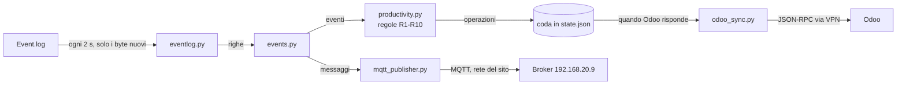

# Selco Logger

Applicazione per il PC Windows della sezionatrice Selco (SEZ1). Legge il log degli eventi della macchina
(`Event.log`) e manda a Odoo:

- le registrazioni di **lavoro** e di **fermo** (`mrp.workcenter.productivity`) con i pannelli prodotti;
- gli **stati macchina** dovuti agli allarmi OSI monitorati (`mrp.workcenter.state`);
- la richiesta di **stampa dei bindelli** al primo pezzo finito di ogni programma;
- gli eventi della macchina sul broker **MQTT** del sito (192.168.20.9, topic `sez/selco`), con gli stessi
  messaggi di `event_new_copy_v2.py`, per il consumatore sull'LXC della stessa rete.

Sostituisce sia il vecchio logger sia lo script `event_new_copy_v2.py`: una volta avviato, quei due
programmi vanno fermati, altrimenti i record arrivano doppi a Odoo e gli eventi doppi sul broker.

È l'evoluzione di [antexsrl/loggerselco](https://github.com/antexsrl/loggerselco). Le regole sono descritte in
[`docs/progetto.md`](../docs/progetto.md): lettura del log §9, registrazioni §10.

## Come funziona



| File | Compito |
|---|---|
| `main.py` | interfaccia di loggerselco: icona a cronometro nella barra di sistema, menu Pause / Restart / Show Configuration / Quit, finestra di configurazione; timer (log ogni 2 s, Odoo ogni `interval` s) |
| `selco.py` | collega i pezzi e salva lo stato in `state.json` dopo ogni passo |
| `eventlog.py` | lettura incrementale di `Event.log`: non tiene aperto il file, legge solo i byte nuovi, riprende dalla posizione salvata, recupera le righe da `EvtBack.log` quando OSI ruota il log |
| `events.py` | trasforma le righe del log in eventi |
| `productivity.py` | regole R1–R10: il tempo va al programma che produce pannelli, fermi sotto i 3 minuti restano lavoro, allarmi sotto `max_time` ignorati |
| `odoo_sync.py` | coda delle operazioni verso Odoo, in ordine; con Odoo irraggiungibile la coda resta in `state.json` e riparte al ciclo successivo |
| `mqtt_publisher.py` | pubblica i messaggi di `events.mqtt_event()` sul broker; attende la connessione con i messaggi in coda, scarta quelli più vecchi di 2 minuti |

La richiesta di stampa dei bindelli viene inviata subito, senza aspettare il ciclo di `interval` secondi.

## Stato (`state.json`)

Contiene la posizione nel log, lo stato delle registrazioni aperte e la coda verso Odoo. Viene scritto su un
file temporaneo e poi rinominato, quindi uno spegnimento improvviso non lo lascia a metà. Al riavvio il logger
riprende esattamente da dove era rimasto, anche dopo giorni di VPN non disponibile.

**Primo avvio:** senza `state.json` il logger parte dalla fine del log attuale; gli eventi precedenti non
vengono inviati. Nel passaggio dal vecchio logger, fermare il vecchio e avviare subito il nuovo. Il vecchio
`activeprogram.json` non viene letto.

## Interfaccia

Come loggerselco: l'applicazione gira nella barra di sistema con l'icona a cronometro, che si svuota fino
al prossimo invio a Odoo. Menu con il tasto destro:

- **Pause / Restart:** sospende e riprende lettura del log e invii;
- **Show Configuration:** finestra con i parametri qui sotto; con OK vengono salvati in
  `configuration.json` (la modifica del broker MQTT vale subito, quella di Odoo al prossimo invio);
- **Quit:** chiude la connessione MQTT, salva lo stato ed esce.

## Configurazione (`configuration.json`)

| Chiave | Campo nella finestra | Note |
|---|---|---|
| `file`, `filebkp` | Event file, Backup file | `Event.log` e `EvtBack.log` di OSI |
| `server`, `port`, `db_name`, `user`, `password` | Server … Password | Odoo |
| `workcenter_code` | Workcenter code | `SEZ1` |
| `interval` | Update interval (secs) | intervallo di invio a Odoo (30–180 s); il log viene letto ogni 2 secondi in ogni caso |
| `logfile` | – | file dei messaggi del logger |
| `mqtt_host` | MQTT broker | predefinito `192.168.20.9`; vuoto = MQTT spento |
| `mqtt_port` | MQTT port | predefinito `1883` |
| `mqtt_topic` | MQTT topic | predefinito `sez/selco` |
| `mqtt_user`, `mqtt_password` | MQTT user, MQTT password | da impostare sul PC: non sono nel repository |

Un `configuration.json` del vecchio logger funziona così com'è: le chiavi MQTT mancanti prendono i valori
predefiniti.

## MQTT

Messaggi identici a `format_event()` di `event_new_copy_v2.py` (verificato su 172.206 righe reali, 72.946
messaggi, nessuna differenza):

| `event_type` | Campi |
|---|---|
| `start_program` | `list_name`, `program_name`, `measure`, `boards_done` (int), `boards_todo` (int), `cut_cross`, `cut_long` |
| `produced_piece` | `cutlist_name`, `pattern_nr`, `height`, `length`, `quantity` (stringhe) |
| `boards_done` | `program_name`, `boards_done` (int) |

Differenze rispetto allo script: al posto di `asyncio-mqtt` c'è `paho-mqtt` direttamente (stessa versione
1.6.1), con la riconnessione automatica nel suo thread; i messaggi attendono la connessione in coda, salvata
in `state.json`. Lo script pubblicava solo gli eventi nuovi (all'avvio saltava il log già scritto): per lo
stesso motivo i messaggi più vecchi di 2 minuti vengono scartati, così un riavvio dopo una lunga pausa non
manda al consumatore pezzi vecchi.

## Installazione

Python 3.8 o successivo. `paho-mqtt` è fissato alla 1.6.1 come nello script: la 2.x cambia l'API.

```bash
python -m venv venv
venv\Scripts\pip install -r requirements.txt
venv\Scripts\python main.py
```

## Test

```bash
cd tests
python -m unittest -v
```

`test_replay` e `test_selco` usano i log reali della macchina: cartella indicata da `SELCO_LOGS`
(predefinita `/home/odoo-dev/loggerselco/log`), altrimenti vengono saltati. Servono `odoorpc`, `pytz` e
`paho-mqtt` (i test non si collegano a nessun broker né a Odoo).
